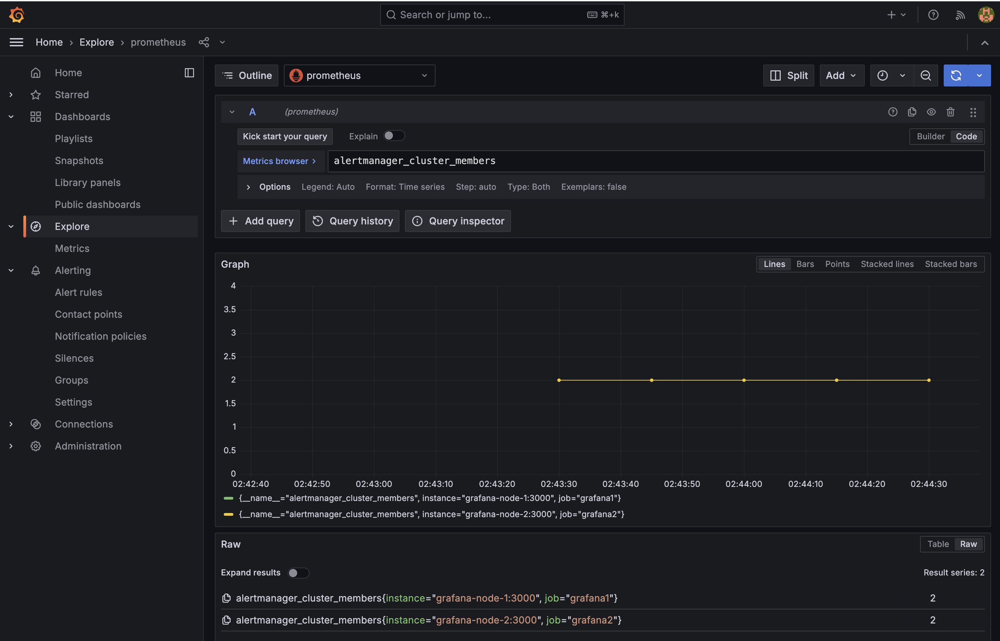

# Demo of Grafana Alerting High Availability using Docker Compose

This example project demonstrates the setup of Grafana Alerting in high availability (HA) mode using Docker compose, Memberlist, and PostgreSQL. 

### Pre-requisites:
- [Docker Compose](https://docs.docker.com/compose/install/)

### Run Grafana using Docker compose

To start Grafana, run the [docker-compose.yaml](./docker-compose.yaml) using the following command:

```bash
docker compose up -d
```

This command starts two Grafana instances, Prometheus, nginx, and PostgreSQL.

```bash
 ✔ Network memberlist_default                         Created          0.0s
 ✔ Container prometheus                               Started          0.0s
 ✔ Container postgres                                 Healthy          0.1s
 ✔ Container grafana-node-1                           Started          0.0s
 ✔ Container grafana-node-2                           Started          0.0s
 ✔ Container nginx                                    Started          0.0s
```

After running the Docker compose setup, you can access Grafana at [localhost:8080](http://localhost:8080). 

You can now verify that Alertmanager HA is working by querying the `alertmanager_cluster_members` metric to find the number of instances in the cluster.



### Configuration 

To learn more about the configuration of this Grafana stack, review the setup in the [docker-compose.yaml](./docker-compose.yaml) file:

- Grafana Alerting enables HA using Memberlist by configuring `ha_peers` and `ha_listen_address` via environment variables.
- PostgreSQL is configured to share data between the two Grafana instances.
- nginx is used to forward incoming requests on port 8080 to the different Grafana instances.
- The Prometheus instance scrapes metrics from the two Grafana instances to monitor the cluster status.

For more detailed information about Grafana high availability, refer to [Set up Grafana for high availability](https://grafana.com/docs/grafana/latest/setup-grafana/set-up-for-high-availability/) and [Configure Grafana Alerting for high availability](https://grafana.com/docs/grafana/latest/alerting/set-up/configure-high-availability/).